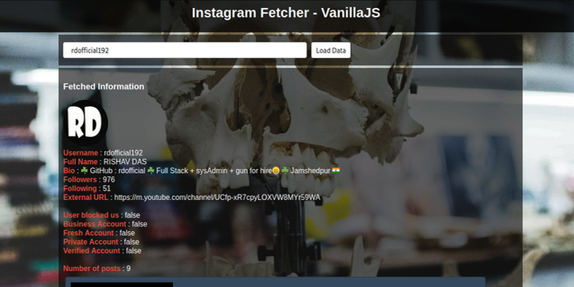

# Instagram Fetcher - VanillaJS

The tool is used to fetch the details about instagram users from the instagram web servers and filter the result data in a form that would make the research more easier. The tool is made using plain vanillaJs (client side javascript) and, HTML and CSS for the web page structure.
Below is an screenshot of already fetched instagram data of author's [instagram account](https://instagram.com/rdofficial192/).

## Note

Before using this tool, there are some things that we should note down :
* Do not use this tool multiple times in a while. If you do continuous usage of this tool for minutes (just fetching part), then the instagram server might block us for sometimes. So, it is a better option to not use this tool over a repeated minutes.

* __Same user pre-loaded :-__ If you try to load data for a same user for a while, then the tool saves the fetched data for a each user to the localStorage of the web browser. So, there is a less chance of getting blocked from the server.

* __Made with VanillaJS :-__ The tool is created using VanillaJs or also the client side javascript. This is what makes this tool as a perfect learning project for beginners (freshers to javascript programming).

* __Updated tutorials on youtube :__ The project's making tutorials are uploaded to youtube at the [author's channel](https://www.youtube.com/channel/UCfp-xR7cpyLOXVW8MYr59WA). The video includes the tutorial on making them to the tutorials on updating the features.

## About author

The tool is written by Rishav Das. I am a programmer and know python (django, general based, data science), javascript (nodeJs), PHP, C, C++. I have written this tool in intention to expertise the javascript language for the beginners. The tool does not need you to learn any server side programming or any sockets / nodes stuff. If you are new to javascript, here is your first project to start off ;-). I have made several beginner level javascript projects and all are available at my [github profile](https://github.com/rdofficial). One more thing about these projects are that the tutorials of making these projects including coding section, mathematical section are uploaded to [my youtube channel](https://www.youtube.com/channel/UCfp-xR7cpyLOXVW8MYr59WA). If you haven't checked out my videos, check them out on my channel, you would get a better practical experience for the projects.

For the contributors, if you want to update any stuff on these projects, you can just create a pull request or just mail me at _rdofficial192@gmail.com_ with the updates. I'll check it out as soon as possible.